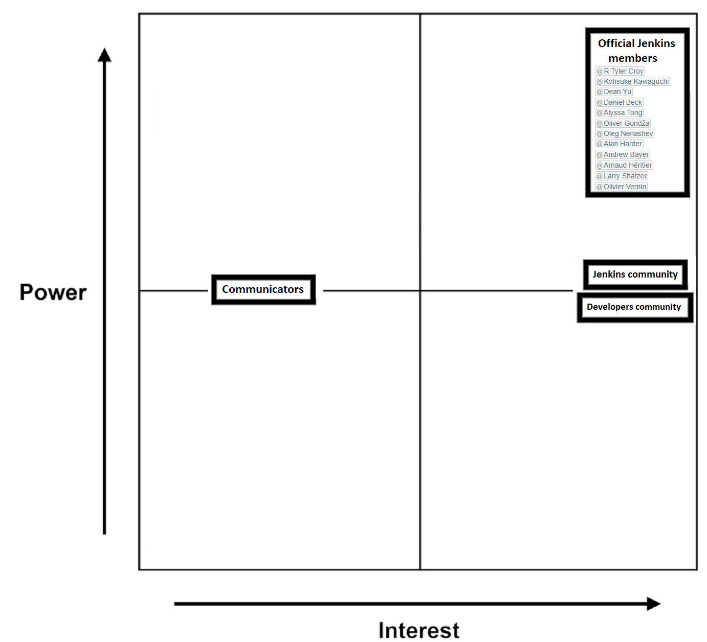
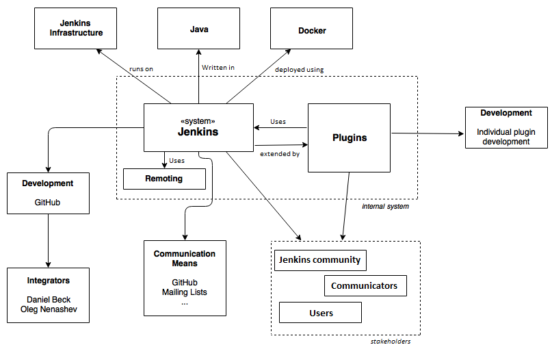
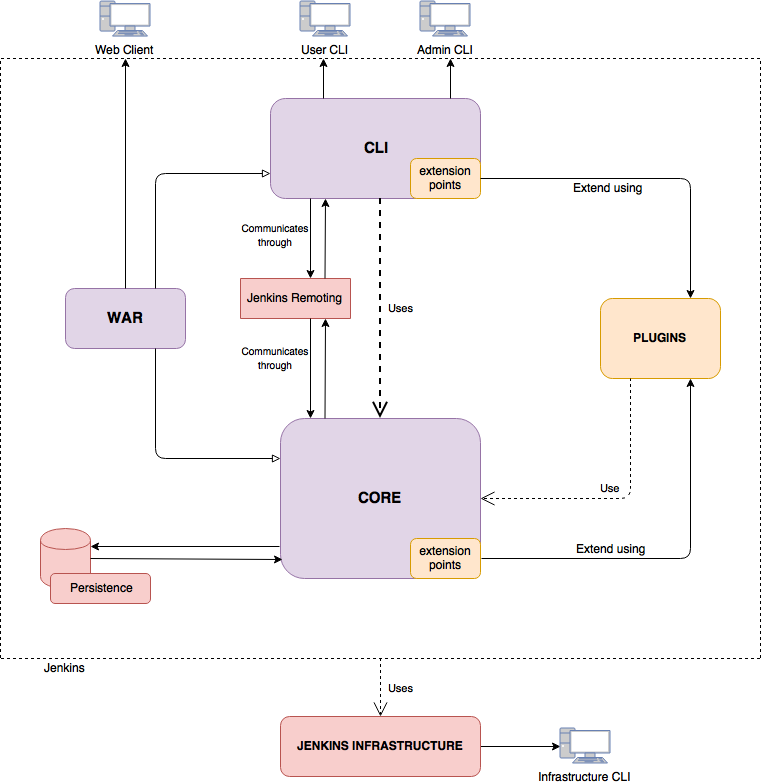
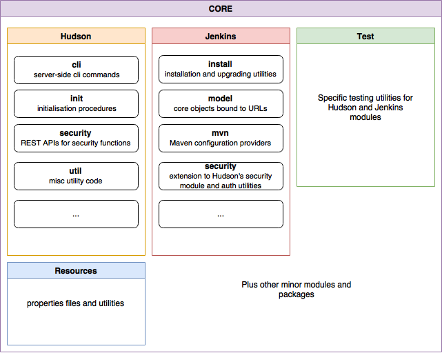
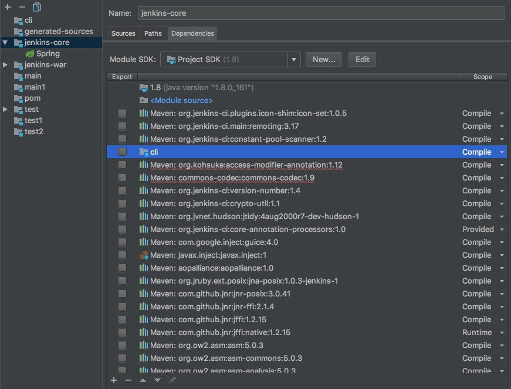
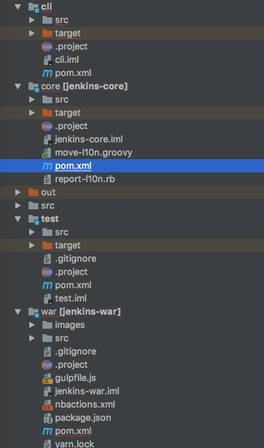
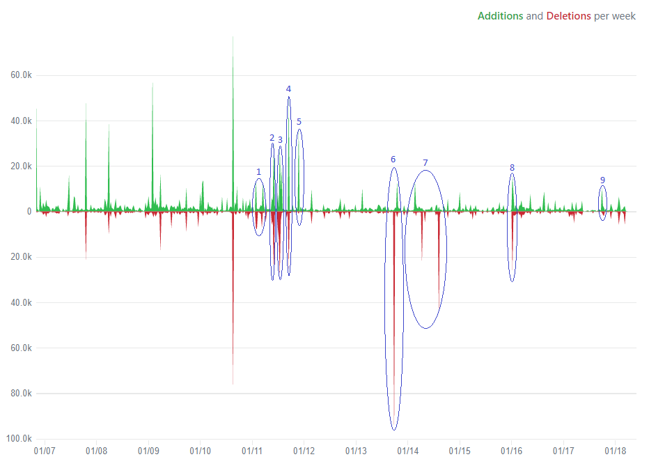

# JENKINS: Build great things at any scale.


Contributors:

* Federico Fiorini (4743105)
* Jeroen Vrijenhoef (1307037)
* Ka Wing Man (4330714)


# Abstract

Jenkins is the leading open source automation server, which provides an efficient and user-friendly way to support building, testing, deploying and automating any project. 
The aim of the entire project is to meet each developer's needs by providing not only the Jenkins automation server itself, but also a list of hundreds possible plugins which could be used to enhance Jenkins' capabilities. 
This chapter provides different views and perspectives of the project, with the aim to create the possibly most complete overview of the architecture itself and all the things that are involved around it. 
These views and perspective range from the stakeholders analysis to the developers perspective, highlighting the key architectural and functional features of Jenkins (and how it interacts with its plugins).
Furthermore, we will conclude the chapter presenting an evolution perspective to highlight the key phases of the development of Jenkins, and a brief conclusion of what we think of the project itself. 

**Acknowledgments:**
We thank former team member Haris Adzemovic for his contributions to this chapter.

# Introduction

Jenkins is a continuous integration tool, having over hundreds of plugins that provide support for automating tasks like building, testing, delivering and deploying the users' own projects, running tests to detect bugs and other issues and doing static code analysis, so that users can actually spend their time doing things machines cannot. [1]. The tool is a Java-based program with packages for Windows, Mac OS X and other Unix-like operating systems.
The tool is accessed and configured on its web interface and the tool can be, as mentioned before, extended via its plugin architecture, being able to provide (possibly) infinite functionalities for Jenkins.
Jenkins can also distribute work across several devices, making Jenkins tasks across multiple platforms faster. 

The Jenkins project is open-source and though it has its main development team that does most programming, everybody can contribute and make pull requests to the project.
Not only writing lines of codes, users can also help translating, make documentation and test the project.

In the Jenkins project, you might see some associations with Hudson, another continuous integration tool developed by Sun Microsystems (owned by Oracle Corporation). This is because Jenkins is a fork of Hudson, made in early 2011 [2].  

This chapter provides an overview of the Jenkins projects, to show the reader how the project/community of Jenkins is built up.
Next, the chapter identifies the stakeholders and integrators of the project, as well as a context view in which Jenkins is placed. Then, it provides both a functional and a development view of the project, explaining the structure of the project in terms of interfaces and modules. The last part contains an overview of the technical debt of the project.

# Stakeholders Analysis

<b>Acquirers</b> <br />
<i>Oversee the procurement of the system or product</i><br />
The Governance board members acts as acquirers of the project. The board is involved in making the ultimate decision when the issues cannot be resolved by the community of the Jenkins project. The members of the board can be found on the Governance Board Page. The members (at the time of writing this document) are ```R Tyler Croy```, ```Kohsuke Kawaguchi``` and ```Dean Yu``` [4] [5].

<b>Assessors</b> <br />
<i>Oversee the system’s conformance to standards and legal regulations</i><br />
The governance board also acts as a public representative of the project and therefore are most likely the ones that deal with standards and legal regulations [4].

<b>Communicators</b><br />
<i>Explain the system to other stakeholders via its documentation and training materials</i><br />
Jenkins also has a website with documentation, a blog, users mailing list, developers mailing list, a Wiki, Twitter account and so on. They could be used to communicate with stakeholders of this project [1].

There are also companies who offer support ranges from training for using Jenkins to consultancy on the software. One of these companies is Cloudbees, where the Jenkins creator ```Kohsuke Kawaguchi``` works.

<b>Developers</b><br />
<i>Construct and deploy the system from specifications (or lead the teams that do this)</i><br />
As this is an open source project, everybody may contribute to this project and thus the code contributors to this project can play the role of developers. These contributions include bug fixes and new features.

<b>Maintainers</b><br />
<i>Manage the evolution of the system once it is operational</i><br />
The maintainers are people who fix bugs and add new features to the project after it has been launched. They are also responsible for actual accepting and rejecting pull requests and pull request code review. Everybody who has been contributing with code belongs to the group of maintainers. 

The top 5 people reviewers in 26-01-2018 – 26-02-2018. The ones in italics actually merged the pull requests. 

1.	_oleg-nenashev_ 31
2.	_daniel-beck_ 20
3.	_Jglick_ 11
4.	_Wadeck_ 9
5.	MarkEwaite 5

<b>Support staff</b><br />
<i>Provide support to users for the product or system when it is running</i><br />
Jenkins does not have an official support staff which you can contact if you need any help with Jenkins. Support can be given by the community of Jenkins instead. 

<b>Infrastructure admins</b><br />
The Infrastructure admins have root access to several servers and build slaves that run on the domain ```jenkins-ci.org``` and the other sub-domains. Their tasks is to keep the aforementioned servers running, installing new software, coordinating mirrors, handling keys and certificates and make sure that the comunity keeps updating the Jenkins project with code. The admins also often appoint others to delegate some partial access to the system to complete some tasks. The list of admins can be found on the Infrastructure Administrators page [4] 

<b>Contributor</b><br />
As specified before (and by Jenkins website), basically anyone can contribute to the project. This means not only write code for the core or its plugins, but basically anything related to the project itself, namely translators, documentation makers, testers, and so on.
That means that a _contributor_ is not strictly identified as a developer or a tester, but could be anything at any time (there's no indication related to the fact that a contributor can switch its role inside the project).
Therefore, in open source projects the contributor can be seen as a different kind of stakeholder with (often) the same functions as a developer, but maybe with less decisional power or who is part of the online community and not of the company/organisation.

## Stakeholder involvement

Another way to classify the stakeholders is to classify them by the power to be able to change the system and by their 
interest in the system.

1. Official Jenkins members <br />
The people who are officially associated with Jenkins in any way. 

2. Jenkins Community <br />
The Jenkins community is the community that helps contribute in Jenkins in any way (e.g. code, documentation etc).

3. Developers community <br />
Developers are the users that uses Jenkins for their own projects.

4. Communicators <br />
See ```R&W Stakeholders``` section


<br>**Fig. 1** -  Power-Interest Grid for Jenkins' stakeholders

# Integrators

It's possible to identify **Daniel Beck** and **Oleg Nenashev** as the main integrators [6], as they're involved in every pull request; moreover, their work is coadiuvated by a restricted (and private) group of contributors, namely the _jenkinsci/code-reviewers_, which helps the two major integrators in the reviewing process. 
The integrators decide whether to accept a change based mainly on code quality and both project and technical fit; in case the code has some problems, they usually propose changes using long discussions and reviews, in which usually ask the contributor to explain why he/she has made that choice. Last but not least, they focus on testing: in fact, in order to accept a pull request, that has to pass from an automatic code checking and testing (named _continuous-integration/jenkins/pr-head_) which highlights if the code has failures and, in that case, it needs a further review. Most of the times, if the code proposed doesn't pass the tests, no merge is performed.
The acceptance time ranges generally from one day to one week, depending on how fast the debate for a pull request goes and on how "important" the contributor is: if it's a top developer, the discussion would take less time and usually those PRs are closed within one day. 

# Context View

## System Scope

* Jenkins is a self-contained, open source automation server built in Java which can be used to automate all sorts of tasks related to building, testing, and delivering or deploying software.
It works along Docker, a container-virtualisation software, and JRE (Java Runtime Environment). Both should be installed while trying to install and setup Jenkins.

* It works with all operating systems: Windows, MacOS and other Unix-based OSs.

* It can be enhanced with many plugins, extending its functionality for every user's demand; they're provided and can be downloaded through the Update Centre. [7]
They can also be browsed using the plugin browser. [8]

* It can either run on a single PC or a distributed system, in order to spread the computational load.

* Through special files (_jenkinsfile_) or the Blue Cloud interface (included in the basic plugin package) it is possible for users to define and manage their own workflows ("pipelines").

* It's also possible to access details such as instance log files or console outputs to see if the build/execution/test/etc. is working as predicted

* Users can be notified during the execution of a pipeline.

## External entities involved

Jenkins (more precisely, its core) have to interact with many entities, which are both internal and external systems.
The most important internal systems with which the core interacts are the Jenkins plugins, as many use cases for the system involve at least some basic plugins. There's a frequent interaction between core and plugin while the system is working, and it's all managed by the code and therefore completely automated (so it's basically transparent to users).
These plugins act as both service and data providers and consumers, as they need the core for their functionality and they extent the core's capabilities or features. 
Another internal system is the so-called _Jenkins Remoting_ [9], which is a library and an executable Java archive which implements the communication layer in Jenkins. This system is essential for the correct operations of the core as it provides all procedures and protocols that allow communication between all system's components through a network. 
The core and the remoting system interact frequently and it's all transparent to users as well. 

There are also several external systems with which the core interacts:

* [_Jenkins Infrastructure_]<br />
Since it's an independent and open source project, the entire infrastructure on which Jenkins is running is maintained along with the project. It can be considered as external because it's not directly part of the core itself, but it interacts with it as the core needs the infrastructure to work. Moreover, it's needed in all use cases that require Jenkins to be distributed. [10]
It's possible to have failures in the infrastructure, but there might be redundancy measures to preserve Jenkins' functionalities. 

* _Github and other communication means_<br />
GitHub is the principal tool for project management, versioning and communication used by Jenkins. It's also the primary source for the code, and all contributors must use it to make their own modifications (either fixes or new features). Jenkins communicates with Github in several ways, for example if the results of the builds of other projects that uses Jenkins are shown on the Github webpage. Github is also used for integrating builds.
Other communication means include mailing lists, forums and also a dedicated Issue Tracker website. [11]

* _Java and Docker_<br />
Java and Docker are required for the installation of Jenkins, and therefore they can be mentioned as two major external systems with which Jenkins interacts. Java provides the framework and the programming language, while Docker provides a virtualisation means [12]. They're both vital in order for the system to work, and their interactions are completely hided from the users, as they're all automated by the code.
 

## Context View Explanation

The final context view can be seen in the diagram below:

<br>**Fig. 2** -  Context Diagram for Jenkins

As it has said before, Jenkins and its many plugins live symbiotically. There are very few use cases where anyone would use Jenkins without any plugins at all. The only feasible use cases we have come up with are related to development of Jenkins itself. All other use cases include at least some basic plugins such as the Green Balls plugin, which colors the icons of tests' status in more intuitive colors than the core package offers. Since most users rely on plugins, the Jenkins core team is very careful not to break plugin compatibility while upgrading the core since this could lead to user abandonment if their workflow is interrupted.
The plugins themselves of course also rely on Jenkins as without a working core, they're useless.

Communication is spread out over many entities as the bigger plugins often have their own websites, forums, mailing lists etc. Jenkins itself mostly uses GitHub, mailing lists and its own website [1]. Documentation is handled by the open source community and available through the same channels as the communication.

Development of Jenkins is done by the open source community. Oleg Nenashev and Daniel Beck are two identified main integrators who approve and merge pull requests. Development of plugins is individual for each plugin.


# Functional View

This chapter focuses on the architectural elements of Jenkins that deliver its functions at runtime

## Capabilities

The key capabilities offered by Jenkins are:

* Continuous integration and delivery

* Extensibility

* Ease of configuration

* Maintaining backwards compatibility

* Dedicated CLI for different types of users

In that sense, Jenkins is expected to provide an efficient service that helps developers in building, testing and delivering their projects. In order to provide a better user experience, and to help users to personalize the building processes, Jenkins is designed to be extensible, in the sense that it's possible to install multiple plugins and configure them easily to meet the developers' needs. 
Next we point out some of the architectural principles that might have been used in designing Jenkins:

* Ease of extension

* High separation of functionalities and concerns

* Loose coupling for core functionalities

## Interfaces and structure

The following image gives a high-level view of the runtime model of Jenkins:


<br>**Fig. 3** - Functional interfaces and entities for Jenkins

It's possible to identify some external interfaces, such as:

* extension points

* web client, user/admin/infrastructure CLI: 

* remoting

In particular, extension points are used to extend core's and cli's capabilites and create new plugins, which will need the core itself in order to work and to provide new functionalities and tools. They're basically interfaces and abstract classes or methods which can be extended for whatever use.
_Jenkins Remoting_ is used to make the CLI and the core communicating, especially in a distributed environment, and it's actually not part of the Jenkins project itself: it only provides communication APIs and procedures. 
Last but not least, there exist many user interfaces, each one of them designed to be used for specific purposes: web client and user CLI are used by normal users to install, upgrade, manage and work on Jenkins, while the admin CLI is used by system administratos to monitor Jenkins and its plugins. The infrastructure CLI is normally used by the maintainers of the _Jenkins Infrastructure sub-project_, and it's function is to ease the monitoring of all the components that help Jenkins to work. 

# Development View

This chapter is focusing on the development view of the Jenkins project. 

## Module Structure

Jenkins is a large project, with a complex architecture consisting of several thousands of lines of source code spread over hundreds of files: in order to have a better understanding of the architecture, as well as for ease of testing and maintenance, the source code is organized into four different modules, each one of them providing a specific functionality.  
The four modules are: 

* __cli__ it provides the command line interface for Jenkins

* __core__ the core source code for the project

* __test__ unit for functional tests on the core code

* __war__ responsible to create the .war file 

The first three modules can also be divided further into submodules. In particular, both __core__ and __cli__ have their own test units inside the modules, which provide specific test functions (in contrast with the more general testing units provided in the __test__ module). 
Furthermore, __core__ module is divided into two logical modules, named _Jenkins_ and _Hudson_, which are further divided into modules, each of them providing a different functionality to the core itself. 
In the following picture there's a quick overview of the main modules in deep: 


<br>**Fig. 4** - Module Structure
 
## Module dependencies

The following picture represents a high-level and conceptual view of modules dependencies, analyzed through code inspection.


<br>**Fig. 5** - Jenkins module dependencies

All dependencies can be found also looking at the `pom.xml` files contained in each module, which are Maven files concerning the project's properties, as well as single modules properties. In particular, in each of them there's a detailed list of modules (internal to the project or external libraries) on which a certain module depends. 
It's important to point out that there's an explicit relation between the _Hudson_ and the _Jenkins_ submodules: in particular, lots of function used in the latter invoke functions contained in the former one.

An example of how these dependencies work can be seen in the following picture, which refers to code analysis done using IntelliJ IDEA and emphasizes when these dependencies are needed.

<br />
<br>**Fig. 6** -  Example of dependencies depicted by IntelliJ IDEA

## Common Design

This section focuses on common processing inside the Jenkins project. It's further divided into subsection for each important area

### Jenkins as common processing

Jenkins plugins can be considered the most important part of the entire Jenkins ecosystem, as they provide augmented core capabilities and new tools or utilities to simplify user interaction or processes. In that sense, it's common to say that plugins are made to meet specific projects' needs. 
While their development is not provided by Jenkins core developers, it's possible to state that core and plugins are somewhat entangled: in that sense, Jenkins core works as the starting point for developing and building new plugins, and they all use its core functions to work; moreover, core developers themselves have made the core's source code in a way that it has some extension points, from which it's possible to create new plugins and functions. 

### External libraries and dependencies

Jenkins modules heavily depends on third-party libraries in order to work, so it's important to define the most important dependencies. Mostly all modules depend on a specific set of libraries, including:

* __JUnit4__ [13] , __Mockito__ [14], __Powermock__ [15] for testing purposes 

* __Apache Commons__ [16] includes all reusable code for I/O purposes, authentication methods, XML scripting, configuration files, logging purposes, ecc.

* __Ant__ [17] and __Maven__ [18] for project build and management

* __Jenkins Remoting__ [19] for communication layer libraries and functions

* __GitHub APIs__ [20] to manage GitHub compatibility with Java (directly developed by Kohsuke Kawaguchi)

### Required design constraints

The philosophy of the project is to have low barriers of entry, so basically anyone can contribute to the project. However, new contributors have to adhere to the standards explained in the `contributing.md` file, which basically provides a template for the pull requests and an overview of the procedures. [21]
Furthermore, the developing team tries to adhere to the Sun Coding Convention [16], but they don't require additional code formatting rules; they also require contributors to look for an overall ease of code understanding, testing and extensibility while making a contribution, as well as looking to retro-compatibility (so it's not safe to remove completely some functionalities from the codeline).
It must be pointed out, however, that they don't force contributors to use these general coding conventions. Citing the _governance document_: 
>With that said, we do not believe in rigorously enforcing coding convention, and we don’t want to turn down contributions because their code format doesn’t match what we use. So consider this informational. [4]

Concerning plugins, as the developing processes are separated, there are no constraints at all, but they can be required by each plugin's developing team. 


### Internationalization

Jenkins is used almost everywhere in the world, so having a correct translation for messages, client interfaces and software itself enhances the user experience and also helps contributors from different countries to work on the software. 
The internationalization extension is therefore a crucial aspect of the overall development of Jenkins, and translators are warmly encouraged to contribute. However, there are a few common aspects that translator need to know:

* _Translation Tool_ and _Translation Assistance Plugin_ are possible tools to make internationalization contributions [22]

* There are three types of resources that need internationalization:
  1. _messages_, which have to be put into the related `Message.properties`
  2. _Jelly messages_
  3. _static HTML references_ for the website
  
Once the translator has done its work, it can submit it like normal code contributions.

## Codeline 

### Source Code Structure

The source code is organized according to the module structure explained before, and in each folder we can see the `pom.xml` file needed to analyze dependencies and properties for that particular component.


<br>**Fig. 7** -  IntelliJ module representation for Jenkins

This simple approach allows an easier understanding of where to put the source files, and the naming conventions used for packages and directories further simplify the maintenance process, as it's possible to locate every file with a small effort. 

### Build, Integration and Test approach

Jenkins uses a peculiar approach when it comes to build and test new features or fixes, because it uses Jenkins itself to automate the process. In that way, developers can have direct feedback on the software's capabilities and functions, and it might be helpful to spot new bugs or possible performance improvements. 
In addition, the building process is further automated using Maven, and the testing units are made using automated tools such as the _Acceptance Test Harness_. [23]

### Release Process

In the Jenkins project, we can define two types of releases that can be made:

* __Weekly Releases__ <br />
Used to deliver bug fixes and new features rapidly to users and plugin developers who need them. Usually these releases involve small or minor changes, and usually contains only a few of them. 

* __Long-Time Supports (LTS) Releases__<br />
These releases are made for more conservative users, which don't need frequent updates in terms of features or minor bug fixes, and they use the same concepts applied for Ubuntu's LTSs. Usually this kind of release contains major or crucial bug fixes, and they are made to ensure a stable environment in which use Jenkins.
The process, described briefly in the LTS download page, involves special types of pull requests, which are called _candidates_ and are tested for several weeks before being published. [24]

# Technical Debt

For analyzing the technical debt, we have used static analysis tools ```CodeFactor``` and ```Findbugs``` [25][26]. Along with static analysis we have also looked at the test-suite and Todo's. Using ```IntelliJ IDEA```, we have imported the Jenkins project before to do a contribution for D2. As IntelliJ IDEA can also be used for analyzing this, this IDE was also used for analyzing coding style.

## Code Quality

### CodeFactor

CodeFactor analyses every source file contained in the repository independant on what type of language is used. Overall a grade of B- (Good) is given to the master branch of Jenkins. The most issues were found in Style and Maintainability categories. Where most of the problems involve unresolved warning statements and unused variables.

### Findbugs

The results for the Findbugs analysis for the __core__ and __cli__ modules are condensed in the table below. The most prevalent warnings in the __core__ module involve either bad practises, dodgy code and even security related warnings. Examples of bad practises that are common are shadowing of superclass names by base classes, incorrect handling of double/float values and improper exception handling (ignoring exceptions). Examples of dodgy code are potential integer overflows and null pointer dereferences (which arguably should also be security warnings). The security warning is related to HTTP header parameters in server responses that contain unsanitized user input. Making it possible for a user to insert arbitrary header fields in the response by including carriage returns/line breaks in certain user input.

The high priority warnings for the __cli__ module are all internationalization warnings, related to reliance of the code on default encoding. This could lead to problems when the project is compiled on systems that have different locale settings, as encoding is different. The dodgy code warning involves a redundant nullcheck.

|Metric                      |__core__|__cli__|
|----------------------------|-------:|------:|
|High Priority Warnings      | 96     | 9     |
|Medium Priority Warnings    | 421    | 1     |
|                            |        |       |
|Total Warnings              | 517    | 10    |

## Historical debt

For the historical debt we decided to analyze past releases of Jenkins over a time period of ~6 months from August 2017 to Februari 2018. Unfortunately CodeFactor does not support analyzing releases (only branches), so we opted to use the Findbugs plugin from ```IDEA IntelliJ``` to get an idea of how the technical debt related to buges changed over time.

The amount of bugs found found by Findbugs per category of bugs over time in the __cli__ module are shown in the table below. As can be seen there is only 1 internationalization warning removed in a 6 month period. The dodgy code (redundant null check) is never fixed.

|Warning Type                            |8-2017|9-2017|10-2017|11-2017|12-2017|1-2018|2-2018|
|----------------------------------------|-----:|-----:|------:|------:|------:|-----:|-----:|
|Internationalization Warnings           |  10  | 10   | 9     | 9     | 9     | 9    | 9    |
|Dodgy code Warnings                     |  1   | 1    | 1     | 1     | 1     | 1    | 1    |
|                                        |      |      |       |       |       |      |      |
|Total                                   |  11  | 11   | 10    | 10    | 10    | 10   | 10   |

The results for the __core__ module is shown in the table below. Overall the amount of bugs found is actually increasing over time. Some subcategories decrease, such as Bad practise warnings. But when they do other bug categories such as correctness and dodgy code warnings actually increase in count. This indicates that while the project is actively being developped they also amount more technical debt. 

|Warning Type                            |8-2017|9-2017|10-2017|11-2017|12-2017|1-2018|2-2018|
|----------------------------------------|-----:|-----:|------:|------:|------:|-----:|-----:|
|Bad practice Warnings                   | 137  | 137  | 137   | 136   | 130   | 137  | 129  |
|Correctness Warnings                    | 137  | 138  | 138   | 142   | 150   | 140  | 150  |
|Experimental Warnings                   | 2    | 2    | 2     | 2     | 2     | 2    | 2    |
|Internationalization Warnings           | 52   | 52   | 52    | 52    | 52    | 52   | 52   |
|Malicious code vulnerability Warnings   | 90   | 90   | 90    | 88    | 89    | 90   | 89   |
|Multithreaded correctness Warnings      | 21   | 21   | 21    | 21    | 21    | 21   | 21   |
|Performance Warnings                    | 19   | 19   | 19    | 19    | 19    | 19   | 19   |
|Security Warnings                       | 1    | 1    | 1     | 1     | 1     | 1    | 1    |
|Dodgy code Warnings                     | 435  | 436  | 437   | 448   | 457   | 443  | 457  |
|                                        |      |      |       |       |       |      |      |
|Total                                   | 894  | 896  | 897   | 909   | 921   | 905  | 919  |

## Test Coverage

This section contains the analysis of the existing testing debt for the Jenkins project. Every module in the Jenkins project structure has its own directory with a test suite. However, the bulk of the functional testing for the __core__ and __cli__ module is done in the __test__ project. The test suites that are located in the __core__ and __cli__ modules are still being used and contain mostly unit-tests for their respective parent modules. These former testsuite contains 6 unit tests and the latter contains 3567 unit tests. Combined with the functional test suite from the __test__ module which contains 9311 tests, makes for a total of 12884 tests. We did not take the javascript test suite from the __war__ module into consideration. The __test__ module also contains integration tests that test the interaction between classes.

The overall test coverage results for the __core__ and __cli__ module are summarized in the table below. For brevity, the individual coverage results for modules are left out.

|Package     | Class, %           | Method, %           | Line, %              |
|------------|:------------------:|:-------------------:|:--------------------:|
|all classes | 77.8% (1849/ 2376) | 59.8% (8468/ 14167) | 56.3% (28147/ 49986) |

When looking at the overall coverage results the line coverage percentage of 56.3% looks fairly decent. However when looking at the coverage at the module level it becomes apparent that some classes are very well tested, while others are not tested at all. For example the __core__ module is completely lacking in unit tests for system management functionality such as file streams and there is a lack of testing of security related code such as the LDAP authenticator. It is also important to note that most tests involve unit tests that test a single method/class as opposed to integration tests.

### Possible Improvements

The results from all previous analysis indicate that there is a lot of technical debt in the Jenkins project, and that the debt touches on multiple aspects from the project. Looking at the bugreports from ```IDEA Intellij```, ```CodeFactor``` and ```Findbugs``` the biggest issues are related to either dodgy code practises (that lead to security vulnerabilities in the code) and the reliance on default encoding. Code duplication and code redundancy is also a big issue, indicating that a lot of code should be refactored.

The Jenkins __war__ module, which contains the website frontend also has a lot of potential improvements. Biggest problems identified here by ```CodeFactor``` are missing gradient files for CSS, leading to bad browser support, lots of overqualified CSS elements and unused variables. The HTML code also contains a lot of deprecated tags and there is a big reliance as well on default encoding. The web frontend is also a big source of technical debt and should be updated or either completely rewritten.

Looking at the test coverage for both the __core__ and __cli__ project, it is obvious some parts of the code are well tested while other parts are not tested at all. Also adding more integration tests is also a big area of improvement.

# Evolution perspective

Originally, Jenkins was developed as the Hudson project, a open-source project developed in Java by Sun Microsystems [27]. The development began in the summer of 2004 with the head developer being Kohsuke Kawaguchi, who worked for Sun Microsystems and its first release was in February 2005.

After Oracle acquired Sun Microsystems, and therefore also Hudson and its trademark ownership, the company insisted on certain changes to the code, infrastructure decisions, process etc. which Kohsuke and other prominent members of the  Hudson community disagreed to do so. Because Oracle had the trademark ownership of the name Hudson, it could at any time revoke the project's right to call itself Hudson. 

After the issue, votes were made to change project name from Hudson to Jenkins. Oracle, however, decided to continue the Hudson project under the name of Hudson. Thus, Jenkins and Hudson continued as two independent projects. 

Looking from the split onward, Jenkins has been continuously update by the Jenkins community, with 759 releases being released since the initial release of Jenkins in February 2011 version 1.0.0 to the latest release in April 2018 version 2.114 at time of writing this chapter. Major changes have been made in version 2.0, released in April 2016. [28][29][30]. 


<br>**Fig. 8** -  Code Frequency diagram

In the graph, there were already commits even before the Jenkins and Hudson split issue. These commit might be old commits from Hudson before the split, but made to the Jenkins repository after it was created. The time of commits can be changed easily, not reflecting the real time of committing.

Other major releases can be seen in the peeks:

1 - 6. Version 1.395 to 1.402, 1.410 to 1.420, 1.421 to 14.427, 1.428 to 1.430, 1.438 to 1.441, 1.526 to 1.537: Lots of bug fixes and small new features. Some of these features are Hudson changes to Jenkins and third-parts libraries upgrades.

7. Added infrastructure for moving items into/out of folders. Addition of a new API. Updates of libraries. UI redesigns.

8. Version 2.0: This version requires Servlet 3.1 and removed AJP support when using embedded Winstone-Jetty container, other implementations. Improvement of documents. Lots of small bug fixes and small new features.

9. Version 1.530 to 1.541: Core of Jenkins migrated from Java 5 to Java 6. Lots of small bug fixes and small new features.

There are still a lot of issues, 1108 critical issues where no solution has yet been committed. With more issues being created than fixed, it seems more contributors are needed to shrink the amount unfixed issues.

# Conclusions

After all the analysis we did on Jenkins, we can conclude that unless its complexity it's a very well-organized project when it comes to the source code structure, making it easy to build, test and deploy. 
Furthermore, having a community of contributors, testers and maintainers which gets bigger and bigger every year contribute to the overall improvement of the project itself and its plugins at each new release; this also makes Jenkins one of the biggest open source projects you can possibly find on GitHub, as shown by the impressive number of repositories and forks of the main repo. 
The analysis we performed during the last weeks also helped us to understand that, despite a good structure of the code, there are lots of possible improvements to the project when it comes to bug fixing and test coverage, as pointed out in the potential improvements section. 
Nevertheless, Jenkins remains a leading automation server, and its being open source surely helped the great spreading this software has, although it also stopped further improvements concerning test coverage and overall code quality (this could be seen as a direct consequence of being open source, as well as having low entry barriers for new contributors, but in general it's not much of an issue yet). 

# References

[1] Jenkins Homepage. https://jenkins.io/ <br />
[2] Hudson's future, blog post by Andrew Bayer. https://jenkins.io/blog/2011/01/11/hudsons-future/<br />
[3] Jenkins governance board. https://wiki.jenkins.io/display/JENKINS/Governance+Board<br />
[4] Jenkins governance document. https://jenkins.io/project/governance/<br />
[5] Jenkins commercial support. https://wiki.jenkins.io/display/JENKINS/Commercial+Support<br />
[6] Integrators, blog post by Georgios Gousios. http://www.gousios.gr/blog/How-do-project-owners-use-pull-requests-on-Github.html<br />
[7] Jenkins update centre. https://updates.jenkins.io<br />
[8] Jenkins plugins browser. https://plugins.jenkins.io<br />
[9] Jenkins Remoting project homepage. https://jenkins.io/projects/remoting/<br />
[10] Jenkins Infrastructure project homepage. https://jenkins.io/projects/infrastructure/<br />
[11] Jenkins JIRA Issue Tracker. https://issues.jenkins-ci.org/secure/Dashboard<br />
[12] Docker and Jenkins Homepage. https://jenkins.io/solutions/docker/
[13] JUnit4 Homepage. https://junit.org/junit4/<br />
[14] Mockito Homepage. http://site.mockito.org<br />
[15] PowerMock GitHub page. https://github.com/powermock/powermock<br />
[16] Apache.org Homepage. https://commons.apache.org<br />
[17] Ant Homepage. http://ant.apache.org<br />
[18] Maven Homepage. https://maven.apache.org<br />
[19] Jenkins Remoting project homepage. https://jenkins.io/projects/remoting/<br />
[20] GitHub APIs, Kohsuke Kawaguchi. http://github-api.kohsuke.org<br />
[21] Contributing.md file on jenkinsci/jenkins. https://github.com/jenkinsci/jenkins/blob/master/CONTRIBUTING.md<br />
[22] Sun Coding Convention. http://www.oracle.com/technetwork/java/codeconvtoc-136057.html<br />
[23] Jenkins acceptance test harness. https://github.com/jenkinsci/acceptance-test-harness<br /> 
[24] Jenkins wiki page. https://wiki.jenkins.io/display/JENKINS/<br />
[25] Jenkins LTS download page. https://jenkins.io/download/lts/<br />
[26] CodeFactor Homepage. https://www.codefactor.io<br />
[27] FindBugs Homepage. http://findbugs.sourceforge.net<br />
[28] Jenkins release 1.936 blog post. http://jenkins-ci.361315.n4.nabble.com/Jenkins-1-396-released-td3257106.html <br />
[29] Jenkins changelog (old version). https://jenkins.io/changelog-old/<br />
[30] Jenkins changelog. https://jenkins.io/changelog/
