# osu! - a fast-paced, community-driven rhythm game for PC

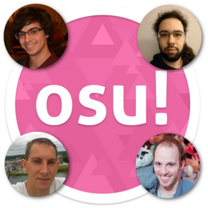

From top left, top right, bottom left, bottom right: Vincent Bejach, Jonathan Levy, Maiko Goudriaan, Pavel Rapoport

## Abstract
_Osu!_ is an open-source free-to-play community-driven rhythm game, aiming to centralize different game modes from arcade or console competitors. It is built in C#.
The project seems well structured, and present a manageable amount of technical debt, although the documentation has been found to be lacking. A significant issue however would be social debt: very little information on the design strategy or on what is needed is communicated to the developers, which could make contributing to the project harder.

## Table of content

* [Introduction](#intro)
* [Stakeholders](#stk)
* [Context view](#ctxt)
* [Functional view](#funcv)
* [Development view](#dvtv)
* [Usability perspective](#usap)
* [Technical debt](#td)
* [Conclusion](#ccl)

<a name="intro"></a>
## Introduction
Rhythm games have historically been mostly developed on arcade or gaming console. However, since 2007, _osu!_ offers a pc alternative, gathering game features from many arcade and console competitors. On August 2016, a new major version of _osu!_ called _osu!lazer_ has been made available as open-source software. The goal was to make _osu!_ available on more platform and improve transparency.

The aim of this chapter is to analyze the architecture of this project and to present an overview of the system. To analyze it, we will refer to the conceptual framework provided by Rozanski and Woods. We will first cover _osu!_'s features and stakeholders, then we will discuss the architecture itself through context, functional and development views. Then, we will discuss _osu!_ from a usability perspective. Indeed, as a rhythm game, _osu!_'s interface and design have a huge impact on the player's performance. Finally, the technical and social debt of the project will be analyzed.


<a name="stk"></a>
## Stakeholder analysis

Let's describe the stakeholders of our project. 

As a disclaimer, the information has been verified on 22-02-2018 and will be subject to changes.  This stakeholders analysis is providing a snapshot of the state of osu!.

### Summary of the stakeholders

We can summarize most of the stackholders in following picture:

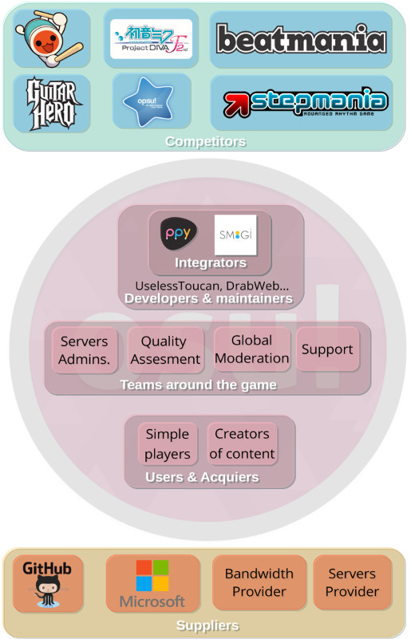
<br> **Figure 1** - _Stakeholders for osu!_

We listed them with the following categories.

| Stakeholder | Description |
| --- | ------- |
| Users | Passive (playing), active (creating content)|
| Acquirers | same as users |
| Developers, maintainers | _peppy_, _smoogipoo_, community |
| Testers | Developers + subset of users |
| Adminitrators | users (running the game), _nekodex_ and _nanaya_ (website) |
| Assessors | Quality Assurance Team, Global Moderation Team, Language Moderators |
| Communicators | _peppy_, various forum members |
| Sponsors | osu!supporters (through merch store) |
| Suppliers | GitHub, Microsoft, ISP, servers owners |
| Competitors | Beatmania, Stepmania, Guitar Hero ... |

Some of the stakeholders need extra attention, we will review them specifically.

### Users

osu! players can be active at various degrees. They can:

- enjoy the game
- create new beatmaps
- create new skins
- help people on the forum
- report issues

Users only enjoying the game are called "passive users", while content creators are called "active users".

Considering all of this, the users appear in several categories of stakeholders.

### Assessors

The assessors are mainly composed of three teams of volunteers:

- Quality Assurance Team (QAT): they check that the new content created by users is of good quality.
- Moderation Team: they operate on a communication level to ensure rules are followed on the in-game chat, the forum, the comments on the website...
- Language Moderators: they are language-specific moderators for subforums, because of the worldwide community.

### Sponsors

To financially support the game, users can buy a supporter's badge on the website, allowing some convenient (but non-crucial) features, like in-game content downloading. Additionally, a merchandise store lets you buy several goodies to help supporting the development. No precise information about the goodies manufacturers could be found.

### Developers

Some developers come and go, others proved to be central in the development process. The following informations about developers are acquired from the [github repository of the project](https://github.com/ppy/osu/graphs/contributors). osu! was open-sourced in September 2016, so it's difficult to get any detailed information about contributors before this date. As far as we know, _peppy_ was mostly the only one working on the project before it was open-sourced.

Contributor | Commits | LOC++ | LOC-- | Active during
----- | - | - | - | -
peppy | 3039 | 153480 | 117840 | 09.2016 - present time
smoogipoo | 1719 | 69818 | 45740 | 01.2017 - present time
DrabWeb | 467 | 29023 | 15659 | 01.2017 - 09.2017
EVAST9919 | 344 | 10920 | 6422 | 12.2016 - 11.2017
huoyaoyuan | 319 | 8109 | 5847 | 09.2016 - 10.2017
Tom94 | 239 | 6334 | 5755 | 09.2016 - 09.2017
SirCmpwn | 220 | 13117 | 6898 | 09.2016 - 03.2017
UselessToucan | 45 | 3954 | 2896 | 10.2017 - present time

As this table shows, _peppy_ is concentrating more than half of the commits, and _smoogipoo_ a fourth. With the contribution history, we conclude that [_peppy_](https://github.com/peppy) (Dean Herbert, founder of osu!) and [_smoogipoo_](https://github.com/smoogipoo) (Dan Balasescu) are the only persons who continuously developed this project from the moment it was open-sourced (or for a very long time).
Other developers keep coming and going. Current [developer team roster](https://osu.ppy.sh/groups/11) is located on the osu! website.

We can summarize the contribution of previously mentioned contributors with a timeline.


<br> **Figure 2** - _Timeline describing developers implication_

To order visualize the stakeholders, we present them in a Power-Interest Grid. Users can be quite different, so they are represented as an area.

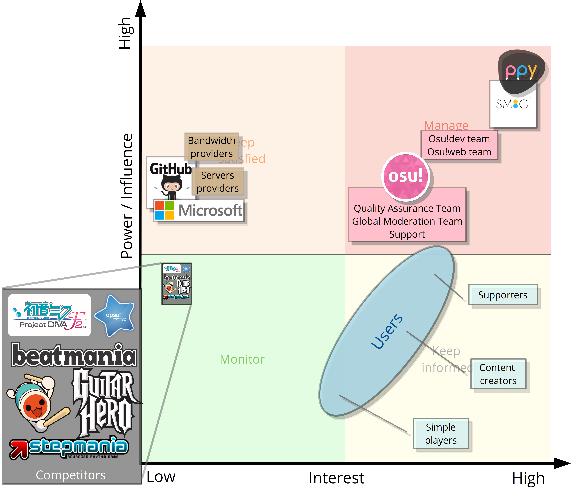
<br> **Figure 3** - _Power-Interest grid for stakeholders._


<a name="ctxt"></a>
## Context view

The context view describes the relationships, dependencies, and interactions between the system and its environment. 

### System scope and responsibilities

_Osu!_ is the _"bestest free-to-win rhythm game"_ that provides entertainment to over 11 million users worldwide, who have so far played over 7.62 billion ranked games. _Osu!_ can either be played unranked or in a competitive ranking system.

After _osu!_ was open-sourced, it became possible for a user to contribute to _osu!_ via code. Besides that, a user can also create and share their own playable content. It can be via beatmaps or via skins applied to game elements.

### External entities

In this section we show and briefly explain the external entities related to _osu!_. We first provide an overview of these external entities.

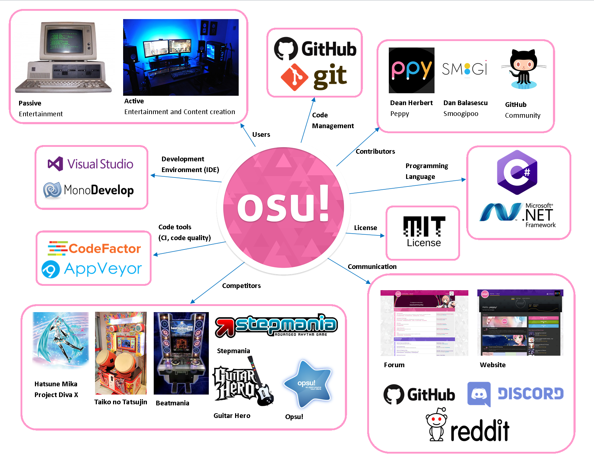
<br> **Figure 4** - _Entity view for osu!_


#### Technical aspects

_Osu!_ is written in C# which is part of the .NET framework created by Microsoft. It is mainly developed in Visual Studio (Windows and macOS) or MonoDevelop (Linux). Version control and code management are done via Git, using a public GitHub [repository](https://github.com/ppy/osu "repository"). For continuous integration AppVeyor is used, with CodeFactor for automatic code review. The code is developed under the MIT License.

#### Developers

The core developers of _osu!_ are Dean Herbert ([peppy](https://github.com/peppy "peppy")) and Dan Balasescu ([Smoogipoo](https://github.com/smoogipoo "Smoogipoo")). With the help of other developers from the GitHub community, _osu!_ is being maintained and extended.

#### Community

The user of _osu!_ are separated in two groups:

- Passive users
- Active users

The groups are categorized by the same attributes as explained in the stakeholders section, thus passive users mainly play _osu!_ for entertainment and active users also actively contribute to it.

The communication between developers goes through GitHub [repository](https://github.com/ppy/osu "repository") or [Discord](https://discordapp.com/invite/ppy "Discord"). The communication between users and developers happens through the [website](https://osu.ppy.sh/home "Website")  and [forum](https://osu.ppy.sh/community/forums "Forum"). The communication between the users happens mostly through the [forum](https://osu.ppy.sh/community/forums "Forum") and [Reddit](https://www.reddit.com/r/osugame/ "Reddit").

#### Competitors

The same competitors as in the stakeholder section are used. As a reminder, a large part of the competitors only exist in an arcade format, or on game consoles. There are only a few competitors playing on the same platform, namely Stepmania, Guitar Hero and Opsu!.

### External Interfaces

Here are the external interfaces used by _osu!_. Interfaces are external sources of code which contain functionalities that can be used in _osu!_. This saves the developers the effort of creating (complicated) code. First, the overview is illustrated then the different interfaces are explained.

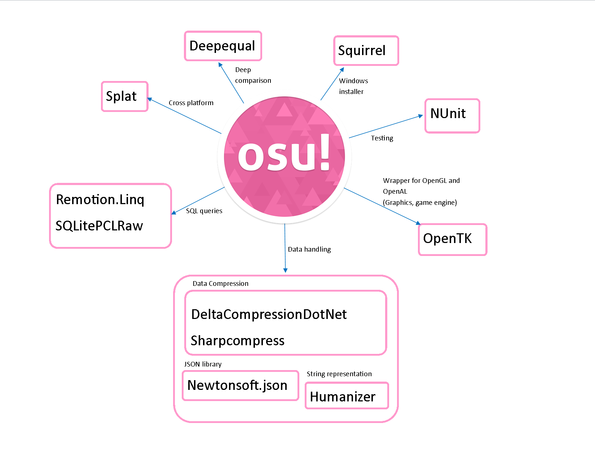
<br> **Figure 5** - _Interfaces around osu!_

The following table describes the interfaces used by _osu!_:

| Library | Functionality |
| --- | --- |
| Deepequal | Extensible deep equality comparison library |
| DeltaCompressionDotNet | Wrapper around Microsoft's delta compression application programming interfaces |
| DotNetZip | Manipulating zip files |
| Humanizer | Manipulating and displaying strings, enums, dates, times, timespans, numbers and quantities |
| Newtonsoft.json | JSON framework that can easily transform objects into JSON and vice versa |
| NUnit | Most popular unit test framework for .NET |
| OpenTK | Wrapper for OpenGL and OpenAL, libraries for creating graphic and sound interface (game engine) |
| Remotion.Linq | Parsing LINQ expression trees and generating queries in SQL or other languages |
| Sharpcompress | Library for dealing with many different compression formats |
| Splat | Used for cross-platform manipulations |
| SQLitePCLRaw | Portable Class Library for low-level access to SQLite |
| Squirrel | Toolset for managing installation and update of software on a Windows platform |

<a name="funcv"></a>
## Functional view

According to Rozansky and Woods, [functional view](https://www.viewpoints-and-perspectives.info/home/viewpoints/functional-viewpoint/) "defines the architectural elements that deliver the function of the system being described". This means its purpose is to demonstate how _osu!_ perform these functions. 

Each functional element is responsible for a certain feature. Responsibilities of functional elements may be fine-grained (for example, "position target circle at specific coordinates") or coarse-grained (such as "creating new beatmap"). We would prefer to stay on a higher level of abstraction to keep our model simple.

We start our analysis by listing the most important features and aligning them to a functional element, responsible for performing this feature.

Functional elements | Features
-------------------|------------------
User information system | <ul><li>Log-in<li>Ranking<li>Account information</ul>
In-game language selector | <ul><li>Internationalization</ul>
Beatmap editor | <ul><li>Creating or editing beatmaps</ul>
Gameplay core | <ul><li>Standard mode<li>Taiko mode<li>Catch mode<li>Mania mode</ul>
Multiplayer | <ul><li>Head to Head mode<li>Tag Coop mode<li>Team Vs mode<li>Tag Team Vs mode</ul>
Communication | <ul><li>In-game chat</ul>
In-game Tweak Tool | <ul><li>Game settings modification</ul>

So from features, which are obviously visible to users, we moved to functional elements. Now it's time to show how they are connected.

In the center of diagram we position the **Gameplay core** element. This function depends on the **In-game language selector** and the **In-game Tweak Tool**. Both of this tools could change visualisation, also the **In-game Tweak tool** can change gameplay options. Optionally it depends on the **Beatmap editor** as you can either create your own beatmap or just download an existing one. Also, there are mutual dependencies with the **User information system**. Depending on the user status, _osu!_ client can, for example, enable automatic downloads of beatmaps for multiplayer. On the other hand, the **User information system** needs information from the **Gameplay core** to provide proper ranking.

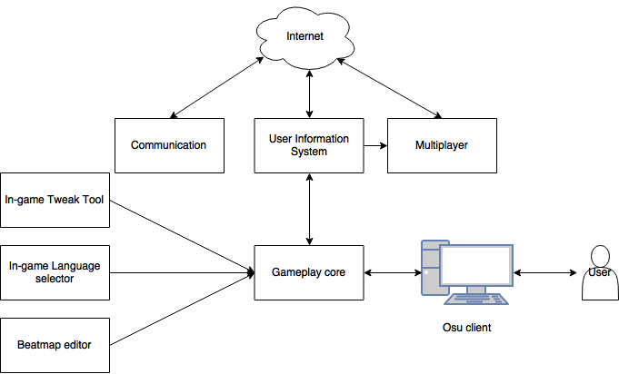
<br> **Figure 6** - _Overview of the features_


As we said, the **Gameplay core** is responsible for running the game. This is quite obvious without complex analysis. So we would like to unfold the **Gameplay core** one more level.

First we jump to the Game project. There are a lot of most derived classes that contain little functionality. However, it contains a calculation logic for different purposes: result calculation, for example, used in processing rankings, hit point calculation which depends on the user settings and game mode etc. This logic is used by Ruleset.X projects, where X stands for a game mode. These projects contain rulesets for the specific game modes. Also the Game project is responsible for arranging menu elements and different screens of the application, while Ruleset.X projects are responsible also for arranging gameplay screen for a given mode.

The Resources project, as its name suggests, contains various resources used by the application, such as fonts, music, sounds, textures etc. 

Osu.Game and Osu.Game.Rulesets.X projects rely heavily on the Framework project which is the framework, developed specifically for _osu!_. This project is even put in separate repository on GitHub. So it would be interesting to make a step into Framework, as it is an important interface for _osu!_.

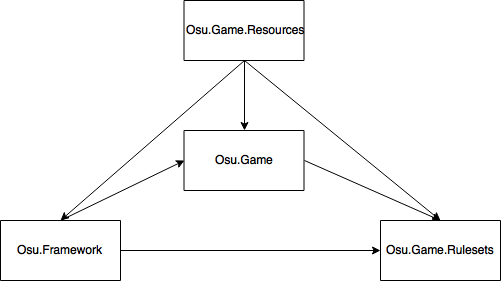
<br> **Figure 7** - _Detailed view of the modules in the main project_


In the Framework we find a huge tool library. All modules are sorted by their purpose. Detailed explanation of all mechanisms provided by this framework would take a lot of time. We will point out the most important ones, such as threading system, platform interaction and input processing. 

Firstly, Threading section contains different thread types and a Scheduler class, which is the heart of the threading system. Apparently, _osu!_ requires more fine-grained threading management. Standard C# tools don't offer the software tools required to keep a high frame rate when dozen of blinking targets appear on screen. Also, it is more convinient to have different thread types for different purposes. Therefore the special threading system was created with different type of threads and the scheduler, which is responsible for managing threads.

Next, Platform section is dedicated to interaction with the Operating System (OS) on which _osu!_ is running. It would be nice to be able to use the clipboard between in-game chat and the OS, or to be able to connect to the server in order to show your skills and climb up the wordwide leaderboards. Platform section provide tools for _osu!_ to interact with the OS and use some of its functionality.

Finally, if the user would want to interact with the game we need Input processing section. It uses OpenTK library to gather raw input from keyboard and mouse. After that it organizes signals in a convenient manner for further processing. Also, this module binds key combinations to a certain game functions.

Also we should just mention other modules: Allocation, which is responsible for memory management; Audio, for processing and editing in-game music; Graphics, which contains everything that is needed to create in-game visual components and configure their behavior.

So, now we can answer the following correlated questions about these projects functionality "What does THIS thing actually do?" and "How is THIS thing working?". _osu!_ menu interface and game modes, implementing features of this game, are located in separate projects. This projects extensively use Framework tools for internal logic and visualization. 

<a name="dvtv"></a>
## Development View
Now, we will cover the code structure and development process of _osu!_ to understand what architecture and what methods of standardization are used in it.

### Module Organization
The project is distributed across three repositories:
- osu-framework, acting as a top layer processing I/O, with which the user interacts to play
- osu-resources, containing the assets used by the application
- osu, the principal game module, containing the game logic

The distinction between ```osu``` and ```framework``` was made to allow Separation of Concerns, and focus ```osu``` on game logic rather than on I/O processing.

The architecture of the modules and their mutual dependencies are shown below:

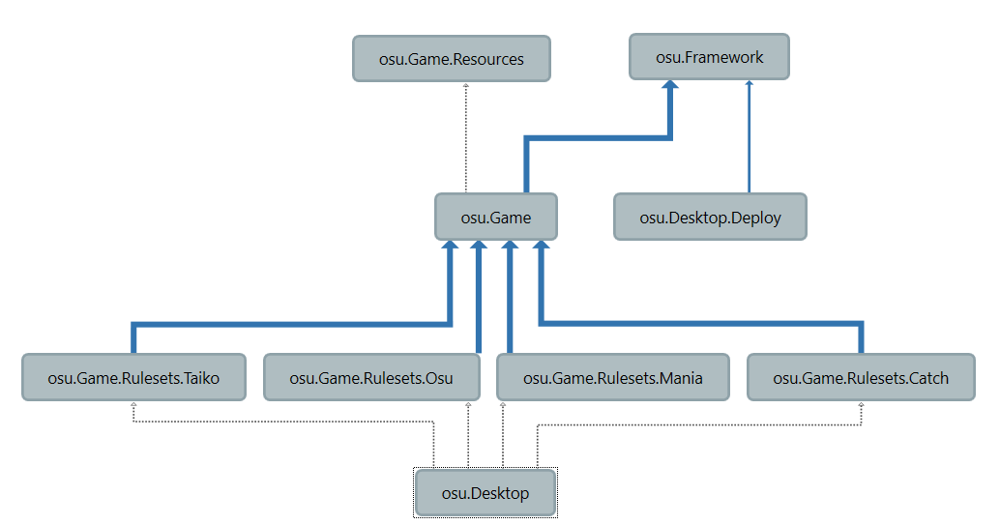
<br> **Figure 8** - _Modules architecture (with transitive arrows)_

Blue arrows represent class calls, while grey ones are project references. Please note that transitive calls are simplified here, and that lower game modules (Taiko, Osu, Mania, Catch) also call the framework directly. 
Full dependencies are shown below:

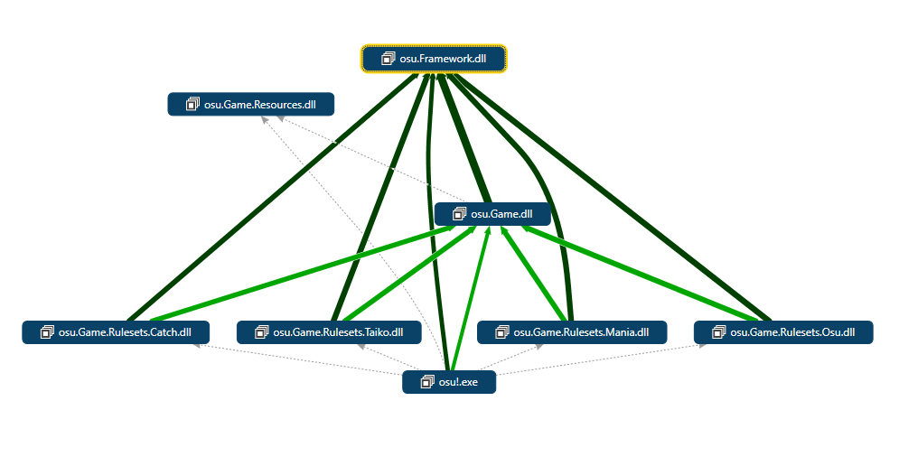
<br> **Figure 8** - _Modules architecture (with full dependencies)_

This structure is very concentric, with every module calling the framework. This was expected, as the framework was designed to centralize I/O and all modules use them. Together with Game, they act as "core" component used by game modes as "customizations".

### Codeline Organization
#### Code storage structure
Codeline is organized in the following structure:

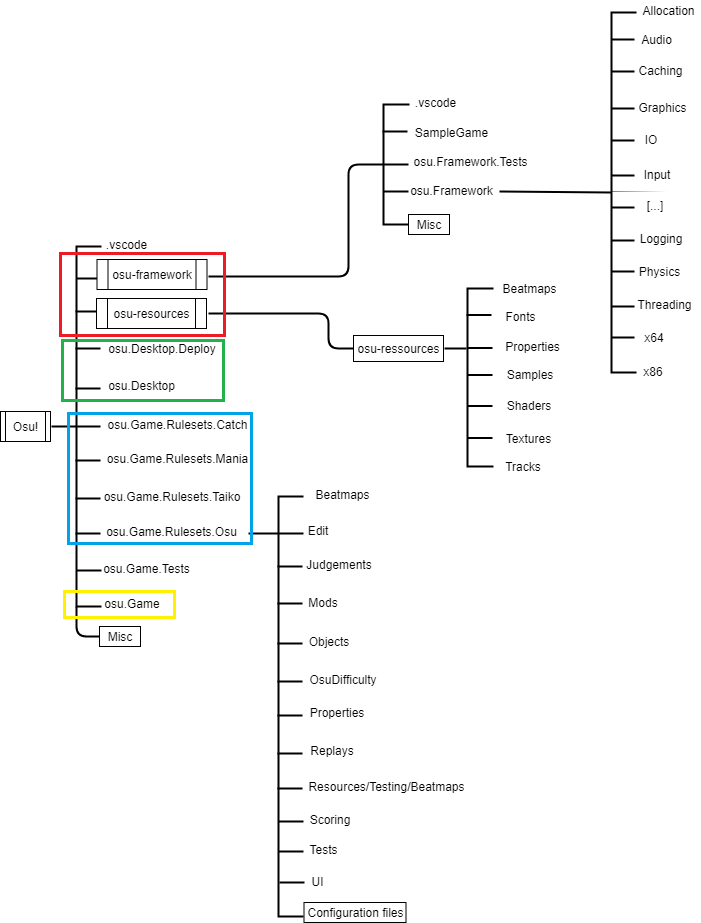
<br> **Figure 9** - _Codeline organization_

The root directory also contains both osu-framework and osu-resources modules. The following table summarizes the different groups of folders:

| Group    |  Color   |  Description   | 
| --- | --- | --- | 
|  Support code   |   Red |  Code and files on which the game code relies  | 
|  Application code  |  Green  |  Code and files used by desktop application on which the game is played (debug & release)  |
|  Rulesets  |  Blue  |  Code defining the different game rules and objectives of _osu!_'s four game mode  |
|  Game  |  Yellow  |  Source code of the game itself  |
|  Miscellaneous  |  /  |  Rest of the files not mentioned (among which configuration & license files)  |

As seen before, Framework is big, and the resources section contains the assets used by the game.
The Ruleset folders all contain similar files: for instance files defining the gamemode beatmaps specificities, the judgments (game won or not, etc).

Although designed separately from Game, Framework would hardly be usable for anything else, since its components seem to be built for dealing with _osu!_-specific components.

The codebase is managed using the GitHub workflow, as well as by some [guidelines](https://github.com/ppy/osu-framework/wiki/Development-and-Testing) strictly enforced by the integrators.

#### Building and release method
_Osu!_ uses continuous integration tool Appveyor to build its successive versions. This allows to get immediate info on the state of the code at every merge.
When finished, the application will be released as standard game installer, including an online updater. For now, there are regular GitHub milestones, to help organize the development team.

### Common Design Models

We noticed some common processing methods:
- The logging is done consistently throughout the project, using a class from Framework.
- Framework itself, as it is called everywhere, constitutes a standard processing method for I/O.

#### Standardization of design
##### State Pattern
This state pattern is used to handle the input of the keyboard and mouse. First, the current state of the input device is captured, then it is further processed.

##### Adapter Pattern
There are many beatmaps in the _osu!_ community and multiple game modes. To overcome the problem that a dedicated beatmap has to be created for every song, gamemode and difficulty combination, the application uses the adapter pattern. It uses the ```BeatmapConverter<T>``` as base class to convert a beatmap.
Below is a part of the adapter class for the osu!catch game mode.


##### Factory and Method Factory Patterns
We noticed several instances of factory classes in the codebase. Among those, we noted a few private factory inner classes in the project and four factory methods in ```CustomizableTextContainer```. The following code snippet shows one of them.


#### Standardization of testing
Several tests modules are created with VisualTest, a Visual Studio feature. It allows to create dedicated views to test classes or modules in separate environments. 
The tests are validated by inspection and semi-automatic execution: a user still has to initiate the testing, it is not part of CI flow.

The project also has around 150 unit tests, checked by Appveyor. This is unusually few, but we'll discuss it in the technical debt section.

<a name="usap"></a>
## Usability Perspective

Usability is a major concern with software, even more in a competitive environment: if users don't interact naturally with your software, they won't use it unless forced to. _Osu!_'s usability is all the more important considering the fact that a rhythm games player heavily relies on their muscular and visual reflexes when playing. Consequently, a clear, readable interface with adapted peripherals is very important.

For this part, we will sometimes compare the interfaces of the current software and its legacy version. We will call the current game that we have analyzed so far "osu!lazer", while the old version will be called "legacy osu!".

### Touch points

First, let's review the touch points of osu!lazer, ie all the places where the user interacts with osu!lazer. The following graph shows how the user jumps from one touch point to another. The peripheral used for each is mentioned. The term "pointing device" is grouping both mouse and drawing tablet, as many players are using a tablet to be able to aim the targets using absolute positioning. Keyboard-oriented interactions are in blue, while pointing-oriented interactions are in pink. Logically, touch points relying on both peripherals are in violet.

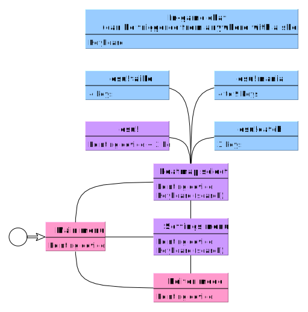
<br> **Figure 10** - _Touch points in osu!'s interface_


This graph shows that osu! ( both osu!lazer and legacy osu!) can be played with usual PC peripherals.

### Interface

"A user interface is like a joke. If you have to explain it, it’s not good."
Following that motto, osu!lazer's interface is straightforward, especially considering how close to other rhythm games interfaces it looks like.

From left to right, top to bottom, here are the beatmap selection screens for each of the following games: Hatsune Miku Project Diva, Beatmania, Guitar Hero, and the current in-development osu!lazer.

*Beatmania being an arcade game, the picture comes from a photograph. We couldn't find any better pictures and apologize for this.*


|   |   |
|:-----:|:-----:|
|  |  |
| Hatsune Miku Project Diva X (Console)| Guitar Hero Live (Consoles)|
| 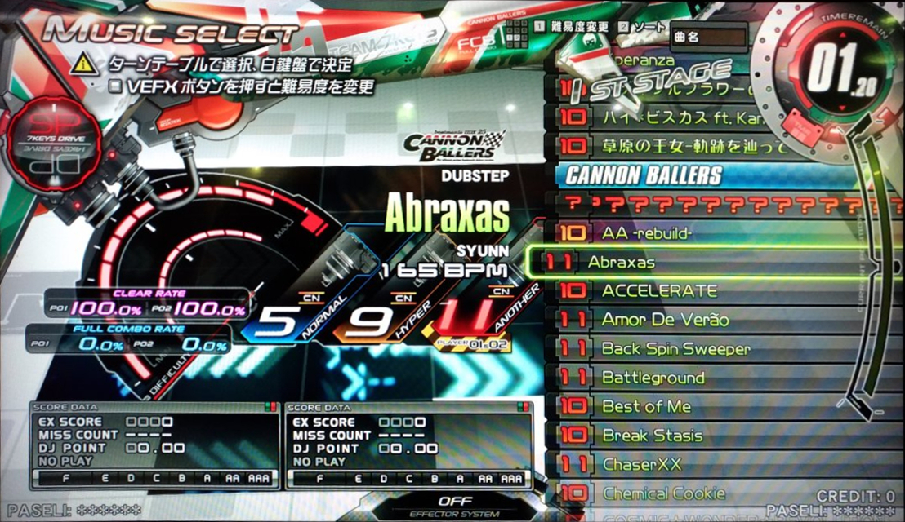  |  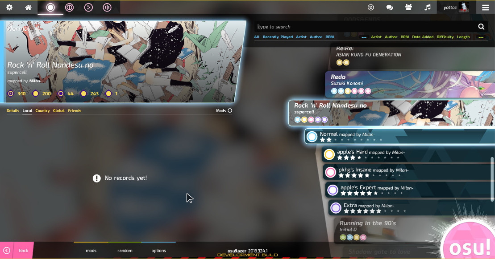   |
| Beatmania IIDX (Arcade)| osu!lazer (PC) |

We can notice several similarities.

* All games have a list of beatmaps (although the term "beatmap" is osu!-specific, the concept is the same).
* They are arranged into a vertical list.
* The difficulty is rated with a number. Most games are using a star-counting system. Beatmania is an exception which only uses numbers.
* Some art about the current highlighted beatmap is shown on the side.
* Also on the side, the current high scores are displayed. 
* All games have a sorting function. Still, this feature is more developed for osu! for two major reasons:
    * First, you can download as many beatmaps as you want, unlike the other games who have a limited number of beatmaps,
    * Being on PC, you can use the keyboard to search, which is impossible on other supports.

All these common points allow players coming from any rhythm game to quickly adapt to osu!lazer's interface.

### Adaptability to the user

With millions of players all around the world, _osu!_ is trying to satisfy a large spectrum of different users that have their own habits or feelings. To do so, it presents several levels of variability.

The first one, as mentioned above, is the pointing device. The most obvious interaction devices to play osu! are the keyboard and mouse. But both legacy osu! and osu!lazer are compatible with drawing tablets, and experienced players tend to prefer them because of the absolute pointing possibility. Technically speaking, this has been realized by implementing raw input instead of relying on the OS mouse input. Another advantage of raw input is to bypass any OS artificial acceleration to make the cursor move the same way your peripheral moves, enhancing accuracy and natural use.

The second level of adaptability is the skin engine. Legacy osu!'s appearance can be completely changed by downloading and installing a skin. Although this feature has been implemented on osu!lazer to some extent, its support is not complete yet. Again, most experienced players recommend using a skin to clarify the game modes, improve readability and thus reduce reaction time. As an example, this is how osu!lazer and legacy osu! appear without skin, and legacy osu! with a custom skin.

|   |   |   |
|:-----:|:-----:|:-----:|
|   |  | 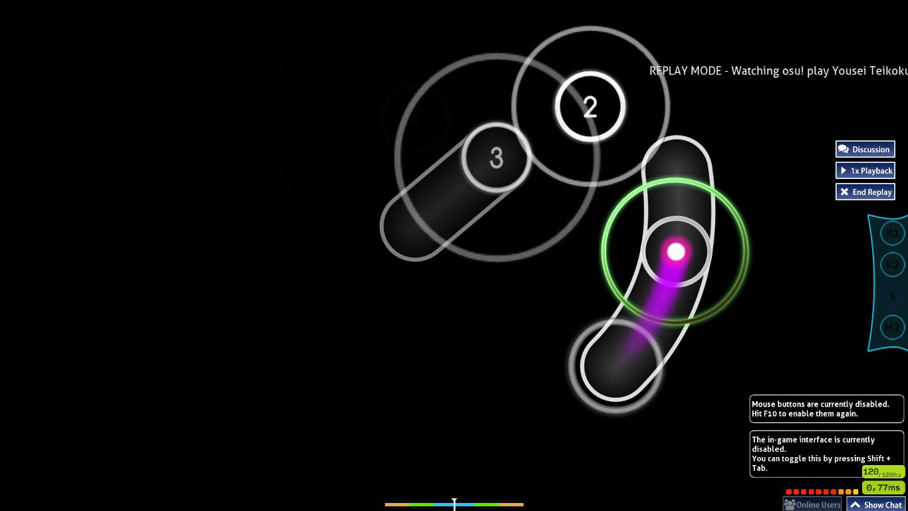|
| osu!lazer with default skin | Legacy osu! with default skin | Legacy osu! with custom skin |

A dim and simple skin as shown on the right is a huge help for cleaning up the interface and leaving only useful visual cues for the gameplay. For example, removing the background video, the different colours of the targets, and having a thicker white border helps reading the beatmap.

Apart from these two major variability points in terms of usability, both osu!lazer and legacy osu! present numerous parameters to tailor your gaming experience. For instance, you can disable the parallax settings (that can make some people dizzy), or you can adapt the frame lag to match the response time of your screen. These settings are available to be sure the player can experience the game in the best conditions. Usability has been thoroughly studied to provide both quick adaptation and high configurability.

<a name="td"></a>
## Technical debt
Technical debt represents the amount of additional work required in order to improve the code quality. In order to measure that of the _osu!_ application we used four tools and conducted manual analysis. The first tool is CodeFactor, which is also used by the developers themselves, by being integrated in the repository. The additional tools are SonarQube, Visual Studio metrics (VS metrics) and ReSharper.

### Evolution of Technical debt

In the next figure we illustrate the evolution of technical debt.


<br> **Figure 11** - _Evolution of technical debt through time_

The first drop can be explained by code being added to the project. After that the technical debt stays constant, however manual inspection indicated that new files barely introduce any debt while modifications tend to add some. In October 2017 a label concerning technical debt was introduced on GitHub. From that moment, improvements were made paying technical debt (noticeable in December). Furthermore, recent modifications added little debt.

### Tool analysis
#### Overall score
The overall scores from the different tools are good, with an average grade A from SonarQube (concerning technical debt) and CodeFacor. VS metrics gives 72/100 points for code maintainability which is a decent score, however this metric is a rather [obsolete](https://avandeursen.com/2014/08/29/think-twice-before-using-the-maintainability-index/). Therefore, we decided to overlook its value and looked at the issues found and used manual inspection to verify. Unfortunately, ReSharper does not provide a total score.

In the next figure the distribution of the technical debt calculated by SonarQube is displayed, highlighting a few outliers containing high amount of technical debt, although their grade is still reasonable.

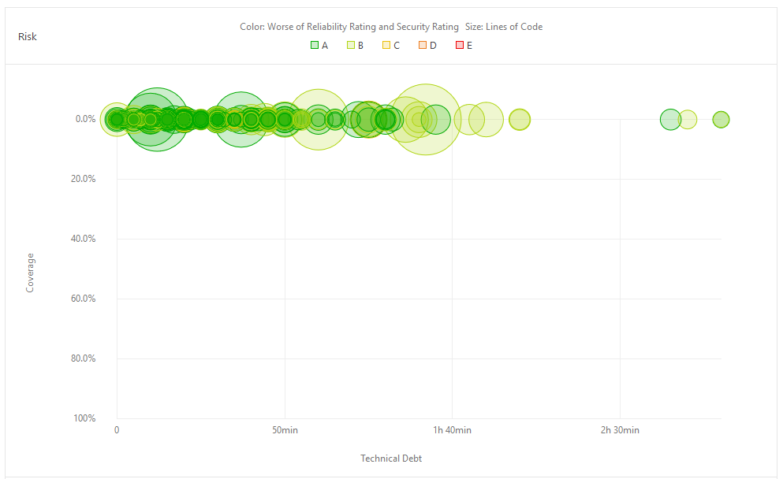
<br> **Figure 12** - _View of technical debt by files, in estimated number of hours needed to fix it_

SonarQube gives two additional scores for bugs (C) and vulnerabilities (B). It is worth noting that a large part of the grade for bugs is due to the lack of asserts in test cases. The next figure contains part of the dashboard of SonarQube including the different ratings.


<br> **Figure 12** - _Welcome screen of SonarQube_


#### Issues found
Using ReSharper, 96 ToDos were identified. They are related to functionality, code quality or gameplay issues. Although it is good that developers are aware about these issues, such policy makes it more difficult to track progress in fixing these issues. These kind of issues should be managed by a centralised issue tracker (e.g. GitHub issues). Furthermore, it complicates comprehension of _osu!_ structure and development strategy by new contributors. ToDos can be used as a short-term solution, when a developer is currently working on that specific section. However, the used ToDos should be removed before merging. This is needed to prevent ToDos from getting lost in the source code and being forgotten about. Moreover, several ToDos are rather unclearly described and open for discussion, which does not encourage resolving them.

Combining the four analysis of the tools, the most common issue is the amount of duplicated code. Code pieces with duplicated code occur mostly in legacy and test classes. To improve code quality it is recommended to refactor the latter classes. A solution for duplicate code is to extract the code to a separate method and call that method. In addition, it is unlikely that legacy code will be refactored if it does not contain known bugs.

Another issue found is the cyclomatic complexity inside several classes responsible for game logic with extensive switch statements. These extensive switch statements could be reduced with some refactoring by introducing a strategy or state design pattern.

Other remarkable issues are: access modifiers, virtual member called in construction, equality comparison of floating point numbers and assignments made in sub-expressions. These issues will most likely not crash the program, however they might be the source of unexpected behavior or decrease the ability to read the code.

### Testing debt

Among the various tools used to analyze the technical debt, none of them could report any test coverage. This was either due to a failure or C# not being supported.

The main testing strategy of _osu!_ relies on visual tests covering most of the visual aspects of the game. By going through parts of the game or interface, it can be verified that the behavior is executed as intended. In the next figure we illustrate an instance of visual tests.

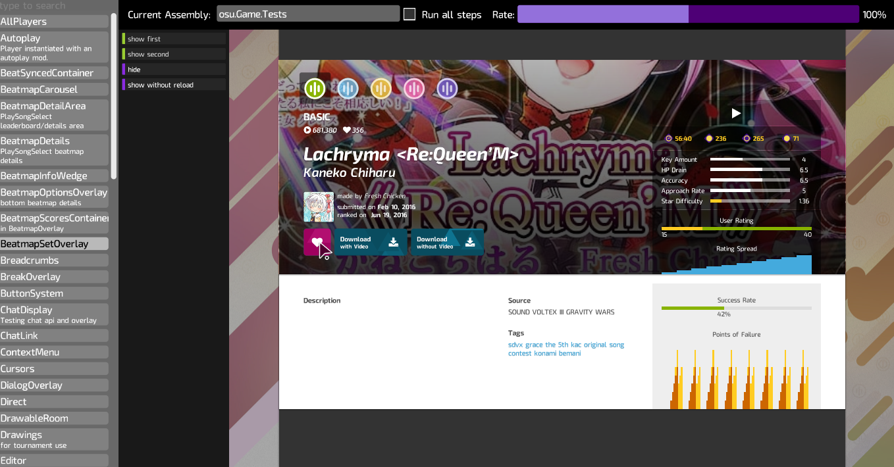
<br> **Figure 13** - _View of visual tests (leftmost column: list of components, second column: list of tests)

There are a few test classes in other packages that test the logic of the game, however their amount is limited and we could not manage to run them in Visual Studio. From [AppVeyor](https://ci.appveyor.com/project/peppy/osu/build/master-7811/tests), we can see that there are 146 passing tests. We can extract from the test names that they consist mostly of constructor tests.

For each project there exist a separate test package containing several test classes. Some of these tests are actual unit tests and some are helper classes for the visual tests, containing no asserts. Remarkably, in a recent pull request ([#2075](https://github.com/ppy/osu/pull/2075)), they prepare the code for more testing.  

With the current testing strategy, the game logic is only coarsely tested, and mainly by visual tests, which does not seem enough. Furthermore, the current testing strategy might explain the various issues detected by SonarQube for tests without any assert.

### Documentation debt
Technical debt is not our only concern about this project. The documentation of _osu!_ is very limited: most classes even lack any documentation. New contributors will find themselves struggling to answer simple questions: what should or can I do and where? Furthermore, no global development strategy is provided by the development team.

### Social debt
The first thing that we noticed is that most of the design decisions, as well as the direction the development is taking, are made by _peppy_. Those who are not, are then often made by _smoogipoo_. While it is understandable _peppy_ should lead the way "his" product evolves, this also leads to a very high bus factor: remove _peppy_ (and perhaps _smoogipoo_) and the development would stop.

Furthermore, the design and development decisions are very scarcely communicated about: be it on GitHub or on the project's Discord channel, we could not find much regarding these aspects. It then only seems logical that most contributions would come from either _peppy_ or _smoogipoo_.

### Recommendation
We would recommend to start working on the documentation of the project. This includes code comments but also how other developers can help to improve and extend the application. This, to make it easier for new developers to contribute to the project and reduce the current bus factor.

Furthermore, they should look into their testing code and strategy, since part of the technical debt is inside these classes. Moreover, the project contains little amount of unit tests for the game logic, although the visual aspects of the game are well tested. These visual tests indirectly also covers several aspects of the game logic but minor mistakes can easily be overseen. Several improvements can then be made to reduce the technical debt.

<a name="ccl"></a>
## Conclusion


With this chapter, we aimed to offer an all-around view on our open source project, _osu!_. First, we've seen that pure development is mainly driven by two people, while users and assessors of content are widely distributed around the globe for this worldwide online game. A tremendous amount of game-related content creation is left to the users: beatmaps, skins, and even seasonal backgrounds to add eye-candy at the game start.

Then, with the functional and development view, we detailed the key features of _osu!_, and how they are integrated in harmony as code. Three main projects allow a good separation of concerns: the framework is dealing with rendering and interaction, the resources contains the assets to use, and the main game implements the game logic and features.

_osu!_ being a rhythm game where precision, readability and handiness directly affect the performance when playing, we took a closer look at usability. We found out that it has two main answers to that concern: first, it mimicks as much as possible the general layout of other rhythm games, to ensure a quick adaptation; then, it allows an impressive flexibility with many settings and the variability introduced by being able to apply a skin. Anyone can tailor the interface by downloading a skin, or even creating a new one.

As any software, _osu!_ has technical debt. Although from our analysis it's not that important in terms of code smell, the lack of tests is more concerning. Moreover, the introduction for newcommers to participate in the code is rather lightweight, when not frankly sparse (in particular considering the lack of in-code documentation for some classes).

All of this make _osu!_ an fascinating project to analyse, and we hope that this chapter has shown how rich this project can be.


We would like to thank:
 * [_peppy_](https://github.com/ppy) for his feedback on our contributions,
 * the osu! community as a whole to have answered some of our questions and participated to our survey,
 * Gijs Weterings, Liam Clark, Romi Kharisnawan who did an excellent job as teaching assistant, providing us feedback and answering our questions, 
 * professors Arie van Deursen, Maurício Aniche, Andy Zaidman for setting up this insightful course.


## References

1. <div id="rw"/>Rozanski, N., & Woods, E. (2011). Software systems architecture: working with stakeholders using viewpoints and perspectives. Addison-Wesley.
