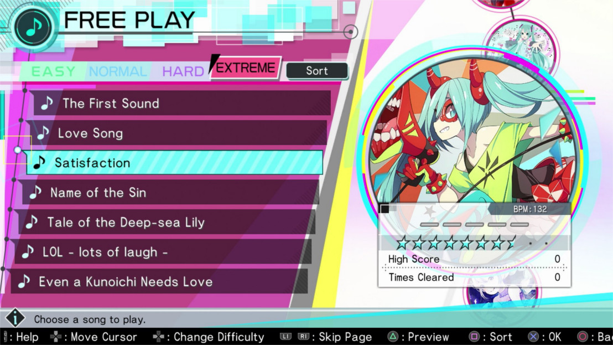
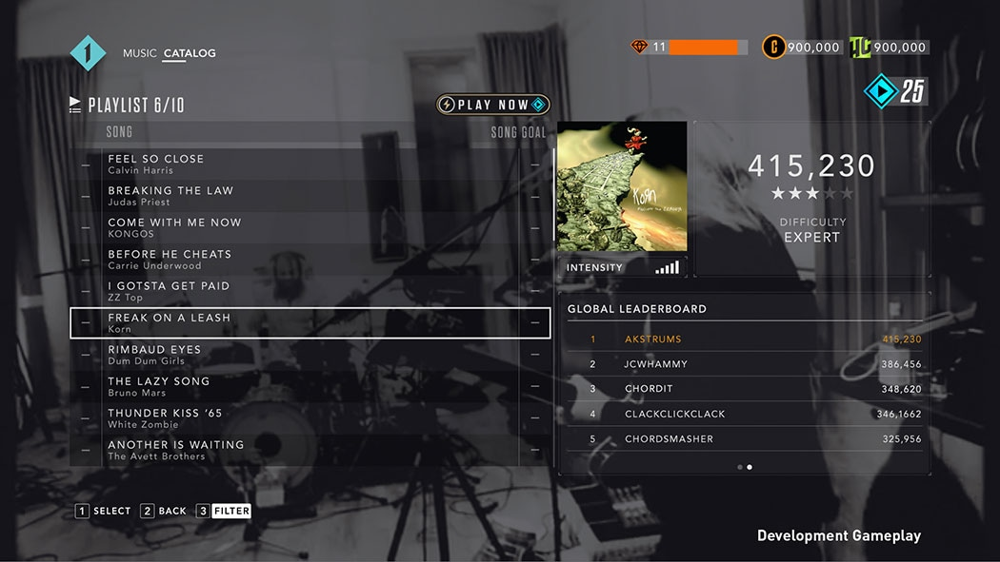
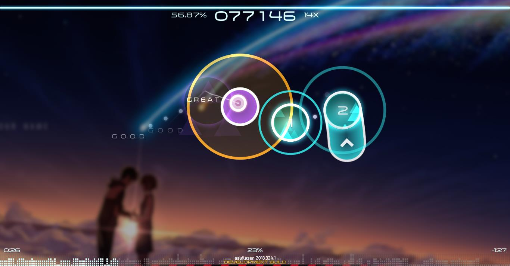
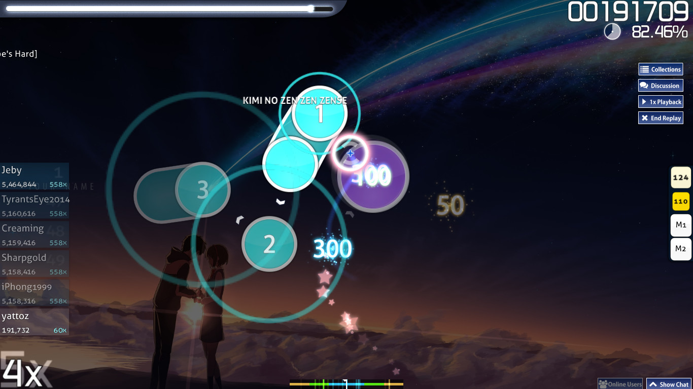

## Usability Perspective

Usability is a major concern with software, all the more in a competitive environment: if users don't interact naturally with your software, they won't use it unless they don't have any other choices. In our case, osu!'s usability is all the more important considering the fact that it's a free rhythm game with many alternative. What's more, a rhythm games player heavily relies on their muscular and visual reflexes when playing. Consequently, a clear and readable interface with various adapted peripherals is all the more important.

For this part, we will at some point compare the interfaces of the current software and its legacy version. For the current game that we have analysed that far, we will use the project name "osu!lazer" ; the old stable version will be called "legacy osu!".

### Touch points

First, let's review the touch points of osu!lazer, this means, all the places where the user interacts with osu!lazer. On the following graph, we show how the user jumps from one touch point to another. The peripheral used for every touch point is mentioned. The term "pointing device" is grouping both mouse and drawing tablet, as many high-ranked players are using a tablet to be able to aim the targets using absolute positioning. Keyboard-oriented interactions are in blue, while pointing-oriented interactions are in pink. Logically, touch points relying on both peripherals are in violet.

This graph shows that osu! (in its concept, both osu!lazer and the legacy osu!) can be played with usual PC peripherals.

### Interface

"A user interface is like a joke. If you have to explain it, it’s not that good."
Following that motto, osu!lazer's interface is straightforward, especially considering how close to other rhythm games interfaces it looks like.

From left to right, top to bottom, here are the beatmap selection screens for one game of each of the following series: Hatsune Miku Project Diva, Beatmania, Guitar Hero, and the current in-development osu!lazer.

*Beatmania being an arcade game, the picture comes from a photograph. We couldn't find any better pictures and apologize for this.*

|   |   |
|:-----:|:-----:|
|  |  |
| Hatsune Miku Project Diva X (Console)| Guitar Hero Live (Consoles)|
|   |     |
| Beatmania IIDX (Arcade)| osu!lazer (PC) |

We can notice several similarities.

* All games have a list of beatmaps (although the term "beatmap" is osu!-specific, the concept is exactly the same).
* These beatmaps are arranged into a vertical list.
* The difficulty is rated with a number. Most games are using a star-counting system. Beatmania is an exception with its fine-grained difficulty reaching 16, and only uses numbers.
* Some art about the current highlighted beatmap is shown on the side.
* Also on the side, the current high scores are displayed. For Guitar Hero Live and osu!, they display online rankings, which has no meaning for Beatmania.
* All games have a sorting function. Still, this feature is more developed for osu! for two major reasons:
    * First, you can download as many beatmaps as you want, unlike the other games who have a limited number of beatmaps,
    * Being on PC, you can use the keyboard to search, which is impossible on other supports.

All these common points allow players coming from any rhythm game to quickly adapt to osu!lazer's interface.

### Adaptability to the user

With millions of players all around the world, the game is trying to satisfy a large spectrum of different users that have their own habits or feelings. To do so, it presents several levels of variability.

The first one, as mentioned above, is the pointing device. The most obvious interaction devices to play osu! are probably the keyboard and the mouse. But as mentioned before, both legacy osu! and osu!lazer are compatible with drawing tablets, and experienced players tend to prefer this peripheral because of the absolute pointing possibility. On a technical side, this has been realized by implementing raw input instead of relying on the OS mouse input. Another advantage of raw input is to bypass any OS artificial acceleration to make the cursor move the same way your periphearl moves, enhancing accuracy and natural use.

The second level of adaptability is the skin engine. The legacy osu!'s appearance can be completely changed by downloading and installing a skin. Although this feature has been implemented on osu!lazer to some extent, its support is not complete yet. Again, most experienced players recommend using a skin to clarify the game modes, improve readability and thus reduce your reaction time. As an example, this is how the osu!lazer and legacy osu! appear without any skin, and legacy osu! with a custom skin.

|   |   |   |
|:-----:|:-----:|:-----:|
|   |  | |
| osu!lazer with default skin | Legacy osu! with default skin | Legacy osu! with custom skin |

A dim and simple skin as shown on the right is a huge help for cleaning up the interface and leaving only useful visual cues for the gameplay. For example, removing the background video, the different colours of the targets, the trailing dots between targets, and having a thicker white border helps a lot reading the beatmap.

Apart from these two major variability points in terms of usability, both osu!lazer and the legacy osu! present numerous parameters to tailor your gaming experience. For instance, you can disable the parallax in the menu settings (that can make some people dizzy), or you can adapt the frame lag to match the response time of your screen. All these settings are available to be sure the player can experience the game in the best conditions. We can say for sure that usability has been thoroughly studied to provide both quick adaptation and high configurability.

